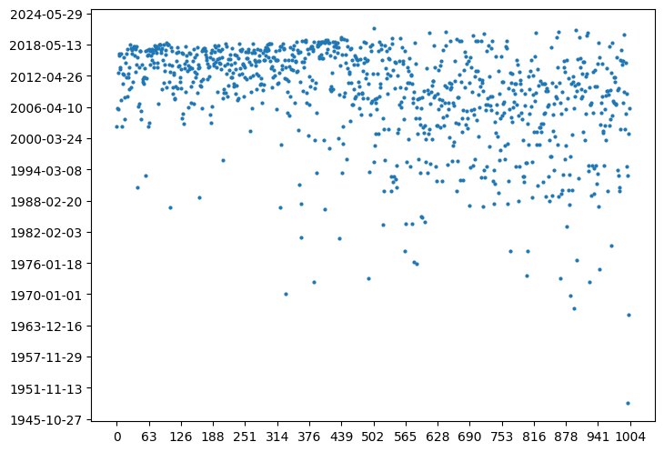

# NetEaseMusic-Analyzer
将你的歌单中歌曲所属年代绘制成图像

## 配置
```bash
git clone https://github.com/thisiszy/NetEaseMusic-Analyzer.git
cd NetEaseMusic-Analyzer
pip install -r requirements.txt
```

## 使用
```bash
python3 neteasemusic.py
```
根据提示进行选择即可，结果将保存到本仓库的根目录下，文件名"result.png"

## 示例结果
