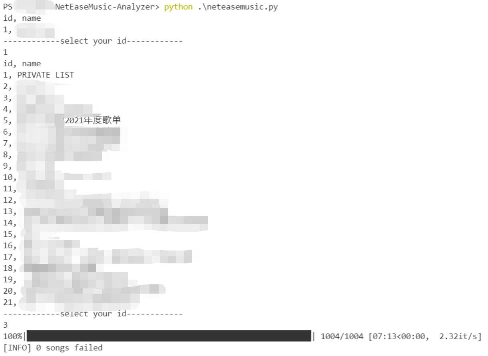

# NetEaseMusic-Analyzer
将你的歌单中歌曲所属年代绘制成图像

## 配置
```bash
git clone https://github.com/thisiszy/NetEaseMusic-Analyzer.git
cd NetEaseMusic-Analyzer
pip install -r requirements.txt
```

## 使用
### step 1
打开网易云音乐，并点击你想要统计的歌单，等待歌单中的歌曲信息全部加载完成后再执行第二步。否则数据库中的歌曲数据很可能不完整，从而分析结果也不准确。

**由于没有登录，所以只能解析公开歌单，私有歌单例如“我喜欢”无法解析，这些歌单将会显示为"PRIVATE LIST"**

### step 2
```bash
python3 neteasemusic.py
```
根据提示进行选择即可，结果将保存到本仓库的根目录下，文件名"result.png"

## 使用示例及结果
### 使用范例

### 结果
